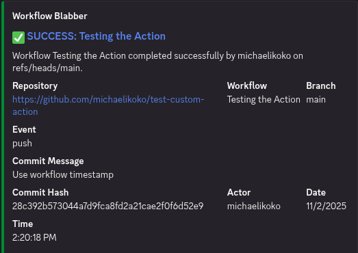
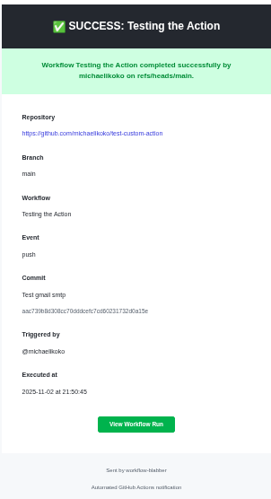
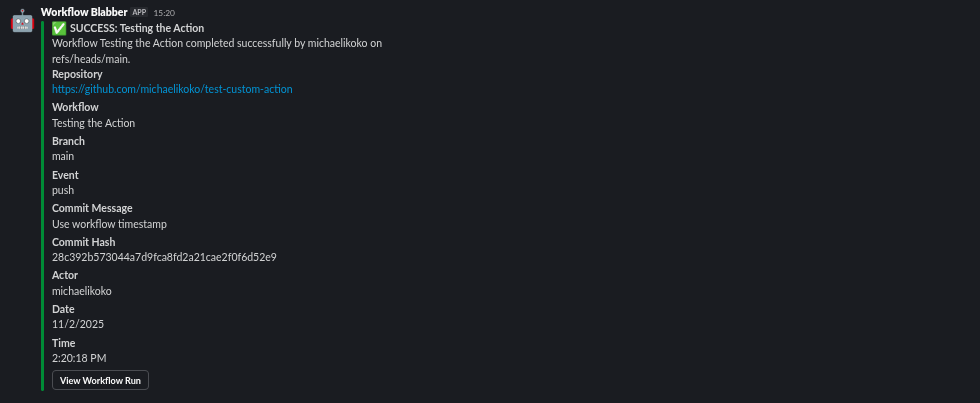
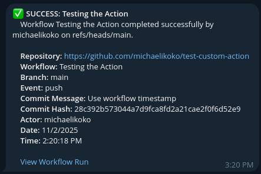

# Workflow Blabber 

**All-in-one notification solution for GitHub Actions workflows.** Get instant alerts via Email, Discord, Slack, and Telegram when your workflows complete.



## Features
- **Email** - SMTP support for any email provider
- **Discord** - Rich embeds with status colors
- **Telegram** - Markdown-formatted messages with your bot
- **Slack** - Beautiful attachments with action buttons
- **Status-aware styling** - Automatic colors and emojis based on workflow status
- **Secure** - Use GitHub secrets for sensitive credentials
- **Parallel delivery** - Send to multiple channels simultaneously
- **Fault-tolerant** - One channel failure won't block others
- **Customizable** - Override titles and messages

## Quick Start

```yaml
name: CI Pipeline

on: [push, pull_request]

jobs:
  build:
    runs-on: ubuntu-latest
    steps:
      - uses: actions/checkout@v4
      
      # Your build steps here
      - name: Build
        run: npm run build
      
      # Send notification on completion
      - name: Notify
        if: always()  # Run even if previous steps fail
        uses: michaelikoko/workflow-blabber@v1
        with:
          channels: 'telegram,discord'
          status: ${{ job.status }}
          telegram_bot_token: ${{ secrets.TELEGRAM_BOT_TOKEN }}
          telegram_chat_id: ${{ secrets.TELEGRAM_CHAT_ID }}
          discord_webhook_url: ${{ secrets.DISCORD_WEBHOOK }}
```

## Supported Channels

| Channel | Features | 
|---------|----------|
| Email | SMTP support, HTML templates, Fallback | 
| Discord | Rich embeds, Status colors, Clickable links | 
| Telegram | Markdown formatting, Bot messages | 
| Slack | Attachments, Action buttons, Colors | 

## Setup Guides
### Email Setup
**Supported Providers:** Gmail, SendGrid, Mailgun, Amazon SES, or any SMTP server.

#### Gmail Example

1. **Enable 2-Factor Authentication** on your Google account
2. **Generate an App Password:**
   - Go to [Google Account Security](https://myaccount.google.com/security)
   - Select "2-Step Verification" → "App passwords"
   - Generate a password for "Mail"
3. **Add secrets to your repository:**
   - Go to your repo → Settings → Secrets and variables → Actions
   - Click "New repository secret"
   - Add the following:

```
Name: SMTP_USER
Value: your.email@gmail.com

Name: SMTP_PASSWORD
Value: [your-app-password]

Name: RECIPIENT_EMAIL
Value: recipient@example.com
```

4. **Use in workflow:**

```yaml
- name: Email Notification
  uses: michaelikoko/workflow-blabber@v1
  with:
    channels: 'email'
    status: ${{ job.status }}
    smtp_host: 'smtp.gmail.com'
    smtp_port: '587'
    smtp_user: ${{ secrets.SMTP_USER }}
    smtp_password: ${{ secrets.SMTP_PASSWORD }}
    recipient_email: ${{ secrets.RECIPIENT_EMAIL }}
    smtp_secure: 'false'
```



---
### Discord Setup

1. **Open Discord** and go to the channel where you want notifications
2. **Click the gear icon** (Edit Channel) next to the channel name
3. **Go to Integrations** → **Webhooks** → **New Webhook**
4. **Customize your webhook:**
   - Name it (e.g., "GitHub Notifications")
   - Choose an avatar (optional)
5. **Copy the Webhook URL**
6. **Add to GitHub Secrets:**

```
Name: DISCORD_WEBHOOK
Value: https://discord.com/api/webhooks/123456789/abcdefgh...
```

7. **Use in workflow:**

```yaml
- name: Discord Notification
  uses: michaelikoko/workflow-blabber@v1
  with:
    channels: 'discord'
    status: ${{ job.status }}
    discord_webhook_url: ${{ secrets.DISCORD_WEBHOOK }}
```


**Security Note:** Never commit webhook URLs to your repository. Always use secrets.

---

### Slack Setup
1. **Go to your Slack workspace**
2. **Visit:** [api.slack.com/apps](https://api.slack.com/apps)
3. **Click "Create New App"** → "From scratch"
4. **Name your app** (e.g., "Workflow Blabber") and select your workspace
5. **Navigate to "Incoming Webhooks"** in the sidebar
6. **Toggle "Activate Incoming Webhooks"** to On
7. **Click "Add New Webhook to Workspace"**
8. **Select the channel** where notifications should appear
9. **Copy the Webhook URL**
10. **Add to GitHub Secrets:**

```
Name: SLACK_WEBHOOK
Value: https://hooks.slack.com/services/T00000000/B00000000/XXXXXXXXXXXX
```

11. **Use in workflow:**

```yaml
- name: Slack Notification
  uses: michaelikoko/workflow-blabber@v1
  with:
    channels: 'slack'
    status: ${{ job.status }}
    slack_webhook_url: ${{ secrets.SLACK_WEBHOOK }}
```


---

### Telegram Setup

#### Step 1: Create a Bot
1. **Open Telegram** and search for `@BotFather`
2. **Send:** `/newbot`
3. **Follow the prompts:**
   - Choose a name (e.g., "Workflow Notifier")
   - Choose a username (e.g., "my_workflow_bot")
4. **Save the bot token** (looks like `123456789:ABCdefGHIjklMNOpqrsTUVwxyz`)

#### Step 2: Get Your Chat ID

**Option A: Message your bot directly**
1. Search for your bot in Telegram
2. Click "Start" or send any message
3. Visit: `https://api.telegram.org/bot<YOUR_BOT_TOKEN>/getUpdates`
4. Look for `"chat":{"id":123456789}` in the response
5. That number is your chat ID

**Option B: Add bot to a group**
1. Create a Telegram group
2. Add your bot to the group
3. Send a message in the group
4. Visit: `https://api.telegram.org/bot<YOUR_BOT_TOKEN>/getUpdates`
5. Look for the group's chat ID (negative number, like `-987654321`)

#### Step 3: Add to GitHub Secrets
```
Name: TELEGRAM_BOT_TOKEN
Value: 123456789:ABCdefGHIjklMNOpqrsTUVwxyz

Name: TELEGRAM_CHAT_ID
Value: 123456789
```

#### Step 4: Use in Workflow
```yaml
- name: Telegram Notification
  uses: michaelikoko/workflow-blabber@v1
  with:
    channels: 'telegram'
    status: ${{ job.status }}
    telegram_bot_token: ${{ secrets.TELEGRAM_BOT_TOKEN }}
    telegram_chat_id: ${{ secrets.TELEGRAM_CHAT_ID }}
```



---
## Usage Examples

### Single Channel

```yaml
- name: Notify on Discord
  if: always()
  uses: michaelikoko/workflow-blabber@v1
  with:
    channels: 'discord'
    status: ${{ job.status }}
    discord_webhook_url: ${{ secrets.DISCORD_WEBHOOK }}
```

### Multiple Channels

```yaml
- name: Notify everywhere
  if: always()
  uses: michaelikoko/workflow-blabber@v1
  with:
    channels: 'email,discord,slack,telegram'
    status: ${{ job.status }}
    # Email
    smtp_host: 'smtp.gmail.com'
    smtp_port: '587'
    smtp_user: ${{ secrets.SMTP_USER }}
    smtp_password: ${{ secrets.SMTP_PASSWORD }}
    recipient_email: ${{ secrets.RECIPIENT_EMAIL }}
    # Discord
    discord_webhook_url: ${{ secrets.DISCORD_WEBHOOK }}
    # Slack
    slack_webhook_url: ${{ secrets.SLACK_WEBHOOK }}
    # Telegram
    telegram_bot_token: ${{ secrets.TELEGRAM_BOT_TOKEN }}
    telegram_chat_id: ${{ secrets.TELEGRAM_CHAT_ID }}
```

### Custom Messages

```yaml
- name: Custom notification
  if: always()
  uses: michaelikoko/workflow-blabber@v1
  with:
    channels: 'telegram'
    status: ${{ job.status }}
    custom_title: 'Deployment Update'
    custom_message: 'Production deployment completed successfully!'
    telegram_bot_token: ${{ secrets.TELEGRAM_BOT_TOKEN }}
    telegram_chat_id: ${{ secrets.TELEGRAM_CHAT_ID }}
```

### Notify Only on Failure

```yaml
- name: Alert on failure
  if: failure()
  uses: michaelikoko/workflow-blabber@v1
  with:
    channels: 'discord,telegram'
    status: 'failure'
    custom_message: 'Build failed! Immediate attention required.'
    discord_webhook_url: ${{ secrets.DISCORD_WEBHOOK }}
    telegram_bot_token: ${{ secrets.TELEGRAM_BOT_TOKEN }}
    telegram_chat_id: ${{ secrets.TELEGRAM_CHAT_ID }}
```

### Multiple Jobs, Single Notification

```yaml
jobs:
  build:
    runs-on: ubuntu-latest
    steps:
      - name: Build
        run: npm run build
  
  test:
    runs-on: ubuntu-latest
    needs: build
    steps:
      - name: Test
        run: npm test
  
  notify:
    runs-on: ubuntu-latest
    needs: [build, test]
    if: always()
    steps:
      - name: Send notification
        uses: michaelikoko/workflow-blabber@v1
        with:
          channels: 'slack'
          status: ${{ needs.test.result }}
          slack_webhook_url: ${{ secrets.SLACK_WEBHOOK }}
```

### Fail Action on Notification Error
```yaml
- name: Critical notification
  uses: michaelikoko/workflow-blabber@v1
  with:
    channels: 'email'
    status: ${{ job.status }}
    fail_on_error: 'true'  # Action fails if email doesn't send
    smtp_host: 'smtp.gmail.com'
    smtp_port: '587'
    smtp_user: ${{ secrets.SMTP_USER }}
    smtp_password: ${{ secrets.SMTP_PASSWORD }}
    recipient_email: ${{ secrets.RECIPIENT_EMAIL }}
```

---

## All Inputs

### Required Inputs

| Input | Description | Example |
|-------|-------------|---------|
| `channels` | Comma-separated list of channels | `'email,discord,slack,telegram'` |
| `status` | Workflow status | `${{ job.status }}` or `'success'`, `'failure'`, `'cancelled'` |

### General Inputs

| Input | Description | Default | Required |
|-------|-------------|---------|----------|
| `custom_title` | Custom notification title | Auto-generated | No |
| `custom_message` | Custom notification message | Auto-generated | No |
| `fail_on_error` | Fail action if notification fails | `'false'` | No |

### Email Inputs

| Input | Description | Required for Email |
|-------|-------------|--------------------|
| `smtp_host` | SMTP server hostname | Yes |
| `smtp_port` | SMTP server port | Yes |
| `smtp_user` | SMTP username | Yes |
| `smtp_password` | SMTP password | Yes |
| `recipient_email` | Recipient email address | Yes |
| `smtp_secure` | Use TLS/SSL | No (default: `'false'`) |
| `email_subject` | Email subject line | No |

### Discord Inputs

| Input | Description | Required for Discord |
|-------|-------------|----------------------|
| `discord_webhook_url` | Discord webhook URL | Yes |

### Slack Inputs

| Input | Description | Required for Slack |
|-------|-------------|---------------------|
| `slack_webhook_url` | Slack webhook URL | Yes |

### Telegram Inputs

| Input | Description | Required for Telegram |
|-------|-------------|------------------------|
| `telegram_bot_token` | Bot token from @BotFather | Yes |
| `telegram_chat_id` | Chat or group ID | Yes |


## Show Your Support
If this action helped you, please consider:
- Starring the repository
- Reporting bugs
- Suggesting new features
- Sharing with others


